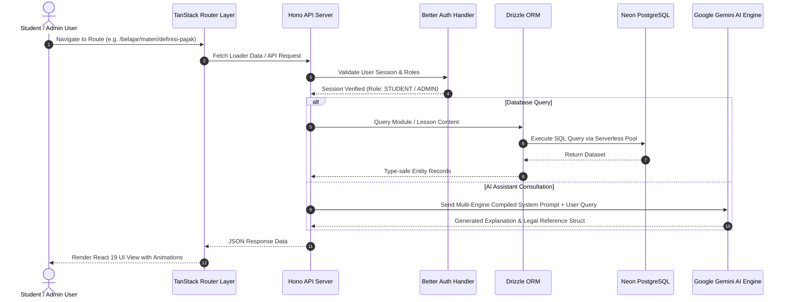

<div align="center">

# 🏗️ Technical Architecture & System Design

### *Pixel (BrevetAI) — Enterprise Full-Stack Architecture Documentation*

[](https://react.dev/)
[](https://tanstack.com/)
[](https://hono.dev/)
[](https://orm.drizzle.team/)
[](https://neon.tech/)
[](https://ai.google.dev/)

---

### 📚 DOCUMENTATION SUITE

| 📘 Master Gateway | 🏗️ Architecture | 🚀 Features | 🗄️ API & DB | 📦 Setup & Deploy |
| :---: | :---: | :---: | :---: | :---: |
| [**README.md**](./README.md) | [**DOCS_ARCHITECTURE.md**](./DOCS_ARCHITECTURE.md) | [**DOCS_FEATURES.md**](./DOCS_FEATURES.md) | [**DOCS_API_DATABASE.md**](./DOCS_API_DATABASE.md) | [**DOCS_SETUP_DEPLOYMENT.md**](./DOCS_SETUP_DEPLOYMENT.md) |

---

</div>

## 📌 Executive Summary

**Pixel (BrevetAI)** is constructed using a high-performance modern full-stack web stack. The application leverages **TanStack Start** and **TanStack Router** for client-server route handling and full-stack React 19 rendering, coupled with an embedded **Hono API engine** running in Node/Nitro server environments. Data persistence is managed via **Drizzle ORM** communicating with a serverless **Neon PostgreSQL** database, while generative capabilities and AI study assistance are powered by multi-engine **Google Gemini API** pipelines.

---

## 🛠️ Complete Technology Stack

```
┌────────────────────────────────────────────────────────────────────────┐
│                        FRONTEND PRESENTATION LAYER                     │
│  React 19  │  TanStack Router  │  Tailwind CSS v4  │  Radix UI  │ Sonner │
└───────────────────────────────────┬────────────────────────────────────┘
                                    │ SSR / API Bridge
┌───────────────────────────────────▼────────────────────────────────────┐
│                         BACKEND APPLICATION LAYER                      │
│  Hono v4 Framework  │  Better Auth  │  Zod Validation  │  tsx / Nitro  │
└───────────────────┬────────────────────────────────┬───────────────────┘
                    │ Database ORM                   │ Generative AI
┌───────────────────▼────────────────┐   ┌───────────▼───────────────────┐
│          DATA PERSISTENCE          │   │         AI ENGINE SUITE       │
│  Drizzle ORM + Neon DB Serverless  │   │   Google Gemini 0.24 + System  │
└────────────────────────────────────┘   └───────────────────────────────┘
```

### Detailed Component Inventory

| Layer | Core Technology | Primary Purpose & Usage |
| :--- | :--- | :--- |
| **Frontend UI** | **React 19.2.0** | Component rendering, concurrent transitions, hooks |
| **Routing & SSR** | **TanStack Start & Router v1.170** | Type-safe routing, code splitting, SSR, data loaders |
| **Styling System** | **Tailwind CSS v4.2 & Radix UI** | Responsive dark/light theme system, accessible dialogs, tabs, popovers |
| **State & Cache** | **TanStack React Query v5.101** | Server state caching, optimistic UI updates, background prefetching |
| **Backend Web Server**| **Hono v4.12 & Node HTTP Server** | Lightweight ultra-fast web framework handling `/api/*` endpoints |
| **Database ORM** | **Drizzle ORM v0.45** | Type-safe SQL query builder and schema definitions |
| **Database Engine** | **Neon PostgreSQL Serverless** | Scalable cloud PostgreSQL with serverless WebSocket pool |
| **Authentication** | **Better Auth v1.6** | User session management, role-based authorization, security tokens |
| **AI Processing** | **@google/generative-ai v0.24** | Gemini model execution, legal text reasoning, content generation |

---

## 🏛️ System Architecture Sequence & Data Flow



---

## 📂 Codebase & Folder Architecture

The project directory structure is strictly modularized into frontend components, routes, server endpoints, schema definitions, and feature modules:

```
pixel/
├── asset/                        # MacBook mockup screenshots and graphic assets
├── api/                          # Serverless entry points for deployment
├── public/                       # Static public assets, favicons, fonts
├── src/
│   ├── components/               # Reusable UI & Business components
│   │   ├── ui/                   # Radix UI + Tailwind primitives (Buttons, Cards, Dialogs)
│   │   ├── admin/                # CMS components (Module editor, Quiz builder, Prompt editor)
│   │   └── student/              # Student components (XP cards, Streaks, Roadmap tree)
│   ├── functions/                # Utility helpers and server functions
│   ├── hooks/                    # Custom React hooks (Theme, Auth, Telemetry)
│   ├── lib/                      # Core configuration (Drizzle client, Gemini client, utils)
│   ├── routeTree.gen.ts          # Auto-generated TanStack Router tree
│   ├── router.tsx                # TanStack Router instance setup
│   ├── routes/                   # File-based TanStack routes
│   │   ├── __root.tsx            # Global Root layout with providers & Toaster
│   │   ├── _app.admin.*.tsx      # Admin Portal pages (Dashboard, Modul, Prompt Studio, Users)
│   │   ├── _app.ai.*.tsx         # AI Assistant pages (Chat, Explained, Notes)
│   │   ├── _app.belajar.*.tsx    # Student Learning pages (Catalog, Reader, Quizzes)
│   │   ├── _app.beranda.tsx      # Student Main Dashboard
│   │   ├── _app.roadmap.tsx      # Interactive Curriculum Journey
│   │   ├── index.tsx             # Public Landing Page
│   │   ├── masuk.tsx             # Login Screen
│   │   └── daftar.tsx            # Registration Screen
│   └── server/                   # Hono Backend Application
│       ├── app.ts                # Main Hono app routing assembly
│       ├── config/               # Environment & system configurations
│       ├── database/             # Drizzle Schema definitions
│       │   ├── schema/
│       │   │   ├── ai.schema.ts
│       │   │   ├── glossary.schema.ts
│       │   │   ├── media.schema.ts
│       │   │   ├── modules.schema.ts
│       │   │   ├── quiz.schema.ts
│       │   │   ├── studi-kasus.schema.ts
│       │   │   └── users.schema.ts
│       │   └── index.ts          # Database instance initialization
│       └── features/             # Hono Feature Controllers
│           ├── ai-engine/        # Gemini AI generation pipeline
│           ├── api-keys/         # API key rotation & management
│           ├── auth/             # Authentication routes & middleware
│           ├── modules/          # Curriculum & lesson CRUD controller
│           ├── prompt-studio/    # 9-Engine Prompt Compiler & Studio
│           ├── quiz/             # Quiz evaluation engine
│           └── users/            # User profile & XP management
├── drizzle.config.ts             # Drizzle Kit migration configuration
├── vite.config.ts                # Vite build & TanStack plugin config
├── package.json                  # Dependencies & scripts
└── tsconfig.json                 # Strict TypeScript configuration
```

---

## 🤖 9-Engine AI Prompt Studio Subsystem

One of Pixel's flagship technical innovations is the **Multi-Engine AI Prompt Studio** located in `src/server/features/prompt-studio/`. Rather than using static prompt strings, Pixel compiles dynamic AI outputs using 9 specialized engine layers:

```
                  ┌─────────────────────────────────────┐
                  │       MASTER SYSTEM ENGINE (#1)     │
                  │   Core identity, mission & bounds   │
                  └──────────────────┬──────────────────┘
                                     │
         ┌───────────────────────────┼───────────────────────────┐
         ▼                           ▼                           ▼
┌──────────────────┐       ┌──────────────────┐       ┌──────────────────┐
│  DEEP RESEARCH   │       │  TAX REASONING   │       │CURRICULUM ENGINE │
│   ENGINE (#2)    │       │   ENGINE (#3)    │       │   ENGINE (#4)    │
└────────┬─────────┘       └────────┬─────────┘       └────────┬─────────┘
         │                          │                          │
         ├──────────────────────────┼──────────────────────────┤
         ▼                          ▼                          ▼
┌──────────────────┐       ┌──────────────────┐       ┌──────────────────┐
│ PEDAGOGY ENGINE  │       │ JSON OUTPUT FMT  │       │  VISUAL ENGINE   │
│   ENGINE (#5)    │       │   ENGINE (#6)    │       │   ENGINE (#7)    │
└────────┬─────────┘       └────────┬─────────┘       └────────┬─────────┘
         │                          │                          │
         └──────────────────────────┼──────────────────────────┘
                                    ▼
                  ┌─────────────────────────────────────┐
                  │  ASSESSMENT (#8) & QUALITY (#9)     │
                  │    Evaluation, validation & output  │
                  └─────────────────────────────────────┘
```

### Engine Specifications

1. **Master System Engine (`MASTER_SYSTEM`)**: Defines overall platform identity, absolute guardrails, tone, and production standards.
2. **Deep Research Engine (`RESEARCH_ENGINE`)**: Multi-source law search engine (UU, PP, PMK, PER, DJP FAQs, tax court precedents).
3. **Tax Reasoning Engine (`TAX_REASONING_ENGINE`)**: End-to-end tax calculation logic (PPh 21 TER tariffs, PTKP, PPN 11%, fiscal reconciliation).
4. **Curriculum Engine (`CURRICULUM_ENGINE`)**: Hierarchy planning for modules, chapters, IKPI sequence, and topic prerequisites.
5. **Pedagogy Engine (`PEDAGOGY_ENGINE`)**: Adaptive learning strategy (scaffolding, real-world analogies, micro-learning chunking).
6. **JSON Output Engine (`JSON_ENGINE`)**: Schema compiler guaranteeing valid JSON format with `{{JSON_SCHEMA_VERSION}}` compatibility.
7. **Visual Engine (`VISUAL_ENGINE`)**: Prompt builder for generating diagrams, flowcharts, infographics, and mindmaps.
8. **Assessment Engine (`ASSESSMENT_ENGINE`)**: Multi-format evaluation engine (Quiz, Flashcard, Matching, Fill-in-Blank, Essay).
9. **Quality Engine (`QUALITY_ENGINE`)**: Multi-layer audit engine validating legal compliance, schema completeness, and citation links.

---

## 🗄️ Database & Connection Pooling Strategy

Pixel connects to **Neon PostgreSQL Serverless** via **Drizzle ORM**:

```typescript
// Connection Pooling Architecture (src/server/database/index.ts)
import { neon, neonConfig } from '@neondatabase/serverless';
import { drizzle } from 'drizzle-orm/neon-http';

// Enables serverless HTTP connection caching
neonConfig.fetchConnectionCache = true;

const sql = neon(process.env.DATABASE_URL!);
export const db = drizzle(sql, { schema });
```

### Data Pipeline Advantages
* **Instant Serverless Cold-Starts**: Low latency HTTP execution optimized for serverless deployments.
* **Type-Safe Schema**: End-to-end inferenced types from database table schemas directly to React frontend components.
* **Zero Connection Exhaustion**: Neon HTTP driver eliminates traditional connection limits.

---

## 🔐 Security & Access Control

* **Session Management**: Handled via `Better Auth` stored in secure HTTP-only cookies.
* **Role Hierarchy**:
  * `STUDENT`: Access to learning dashboard, roadmap, quizzes, flashcards, case studies, and AI assistant.
  * `ADMIN`: Access to content management, quiz creation, and module updates.
  * `SUPER_ADMIN`: Full access including System Settings, Gemini Key Rotation, Prompt Studio Compiler, and User Role assignment.

---

## 🚀 Performance Optimizations

1. **Route Pre-fetching**: TanStack Router automatically pre-fetches page bundles on hover.
2. **Asset Optimization**: All screenshot previews and interface graphics use high-compression WebP formats.
3. **Tailwind CSS v4 Engine**: Uses Oxide compiler for ultra-fast CSS generation and minimal output bundle size.
