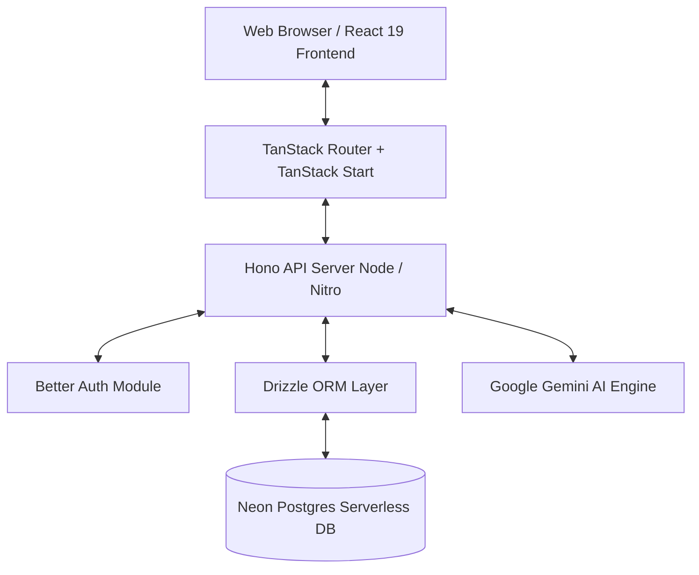

<div align="center">

# ⚡ PIXEL (BrevetAI)

### *Next-Generation Interactive Learning Platform & AI-Powered Tax Education Ecosystem*

[](https://react.dev/)
[](https://tanstack.com/)
[](https://hono.dev/)
[](https://orm.drizzle.team/)
[](https://neon.tech/)
[](https://ai.google.dev/)
[](https://tailwindcss.com/)
[](https://www.typescriptlang.org/)

---

### 📚 DOCUMENTATION SUITE

| 📘 Master Gateway | 🏗️ Architecture | 🚀 Features | 🗄️ API & DB | 📦 Setup & Deploy |
| :---: | :---: | :---: | :---: | :---: |
| [**README.md**](./README.md) | [**DOCS_ARCHITECTURE.md**](./DOCS_ARCHITECTURE.md) | [**DOCS_FEATURES.md**](./DOCS_FEATURES.md) | [**DOCS_API_DATABASE.md**](./DOCS_API_DATABASE.md) | [**DOCS_SETUP_DEPLOYMENT.md**](./DOCS_SETUP_DEPLOYMENT.md) |

---

</div>

## 🌟 Overview

**Pixel (BrevetAI)** is a state-of-the-art, full-stack interactive educational application designed specifically for tax law mastery, Brevet A/B curriculum learning, interactive simulations, and AI-assisted case study solving. Built with **React 19**, **TanStack Start**, **Hono**, **Drizzle ORM**, and **Google Gemini AI**, Pixel merges gamified learning experiences (XP points, streak counters, interactive quizzes, flashcards, mind maps) with enterprise-grade administration tools (9-engine AI Prompt Studio, Claude JSON importer, live system telemetry, and content management).

> [!NOTE]
> **Repository**: [github.com/dresar/pixel](https://github.com/dresar/pixel)  
> **Status**: Production Ready & Fully Modular Architecture.

---

## 📸 Visual Showcase & Asset Gallery

Below is a showcase of Pixel's key user interface screens captured directly from the live application environment:

### 1. 🔐 Authentication & Quick-Fill Portal
Streamlined authentication system supporting multi-role sign-in (Student, Content Admin, Super Admin) with quick-fill demo keys for instant testing.


---

### 2. 🎓 Student Learning Dashboard
Personalized learning hub featuring current streak tracking (14-day streak), accumulated XP points (1,450 XP), progress tracking, active module resume buttons, and 24/7 AI Tax Assistant consultation shortcuts.
.webp)

---

### 3. 🗺️ Interactive Learning Roadmap
Guided step-by-step curriculum path mapping out Brevet A & B modules with estimated durations, earned XP badges, and structured progression tracking.
.webp)

---

### 4. 📖 Learning Materials Catalog & Detail Reader
Browse tax topics (Definisi Pajak, Subjek/Objek Pajak, PPh 17, Self-Assessment) with interactive story hooks, legal statute references (UU HPP & PMK 168), reading duration estimates, and floating AI assistant explanations.

| Materials Catalog | Material Detail Reader |
| :---: | :---: |
| .webp) | .webp) |

---

### 5. 💼 Interactive Case Studies & Simulations
Real-world tax scenario simulations covering dispute resolution (Keberatan SKP), PPN tax invoices (Faktur Pajak PER-03/PJ/2022), fiscal reconciliation, and SPT 1770 tax returns with level progression (Basic, Intermediate, Advanced).
.webp)

---

### 6. 📊 Admin Dashboard & Telemetry
Comprehensive administrative overview featuring total user metrics, active education modules, evaluation quiz banks, AI content engine status, and recent user signups.
.webp)

---

### 7. 🤖 AI Prompt Studio & Multi-Engine Compiler
Enterprise AI compilation suite featuring 9 specialized AI prompt engines: Master System, Deep Research Engine, Tax Reasoning Engine, Curriculum Engine, Pedagogy Engine, JSON Engine, Visual Engine, Assessment Engine, and Quality Engine.
.webp)

---

### 8. 🛠️ Admin Content Management & Case Study CMS
Full CRUD administrative suite for managing modules, chapters, case study scenarios, and importing structured Claude AI JSON curriculums.

| Curriculum Management | Case Study CMS |
| :---: | :---: |
| .webp) | .webp) |

---

### 9. ⚙️ System Settings & Infrastructure Status
Live server monitoring displaying Neon Postgres serverless database status, Better Auth session state, Gemini key rotation array status (54 API keys), minimum pass grade configuration, and platform branding settings.
.webp)

---

## ⚡ Key Features Matrix

| Feature Module | Student Experience | Admin Capabilities |
| :--- | :--- | :--- |
| **🎓 Learning & Roadmap** | Interactive modules, story hooks, legal statutes, estimated reading time | Create, update, reorder modules, JSON Claude import |
| **🤖 AI Assistant** | 24/7 AI tax consultation, legal article explanations, study notes | 9-Engine Prompt Studio, versioning, prompt compilation |
| **📝 Evaluation & Quizzes** | Multiple choice, flashcards, instant grading, XP rewards | Bank kuis management, difficulty levels, score threshold |
| **💼 Case Studies** | Interactive simulations, fiscal reconciliation scenarios | Scenario builder, legal outcome definitions |
| **🏆 Gamification** | Daily streaks, XP levels, global leaderboard, certificates | User XP tracking, progress analytics |
| **⚙️ System Settings** | Dark/Light mode toggle, profile management | Database health check, Gemini key rotation, global settings |

---

## 🏗️ System Architecture Snapshot



For full technical specifications, see [**DOCS_ARCHITECTURE.md**](./DOCS_ARCHITECTURE.md).

---

## 🚀 Quick Start

### 1. Clone & Install Dependencies
```bash
git clone https://github.com/dresar/pixel.git
cd pixel
npm install
```

### 2. Configure Environment Variables
Copy `.env` and fill in your database and API credentials:
```bash
cp .env .env.production
```
Make sure `DATABASE_URL` (Neon Postgres) and `GEMINI_API_KEY` are properly defined.

### 3. Push Database Schema
```bash
npm run db:push
```

### 4. Run Development Server
```bash
npm run dev
```
Access the application at `http://localhost:3000`.

For detailed installation and deployment instructions, see [**DOCS_SETUP_DEPLOYMENT.md**](./DOCS_SETUP_DEPLOYMENT.md).

---

## 📂 Documentation Deep-Dives

Explore the comprehensive documentation suite:

* 🏗️ **[DOCS_ARCHITECTURE.md](./DOCS_ARCHITECTURE.md)** — Architectural design, tech stack details, Hono backend structure, Drizzle ORM, and AI Engine pipeline.
* 🚀 **[DOCS_FEATURES.md](./DOCS_FEATURES.md)** — Complete walkthrough of all student and administrative features with embedded visual assets.
* 🗄️ **[DOCS_API_DATABASE.md](./DOCS_API_DATABASE.md)** — Comprehensive reference for Neon Postgres database schemas and Hono API endpoints.
* 📦 **[DOCS_SETUP_DEPLOYMENT.md](./DOCS_SETUP_DEPLOYMENT.md)** — Complete guide for setup, `.env` configuration, database migration, and cloud deployment (Vercel/Cloudflare).

---

## 📄 License & Credits

Built with ❤️ by [dresar](https://github.com/dresar) using **TanStack Start**, **React 19**, **Hono**, **Drizzle ORM**, **Neon Database**, and **Google Gemini AI**.
